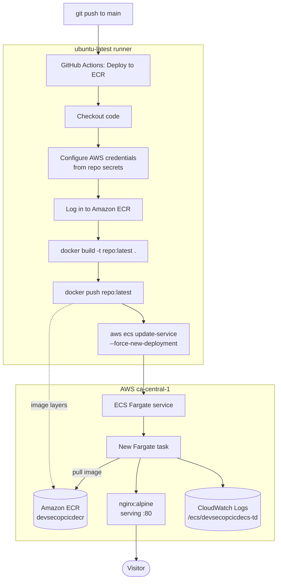
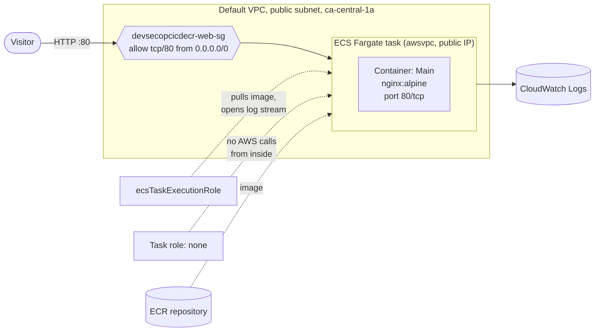
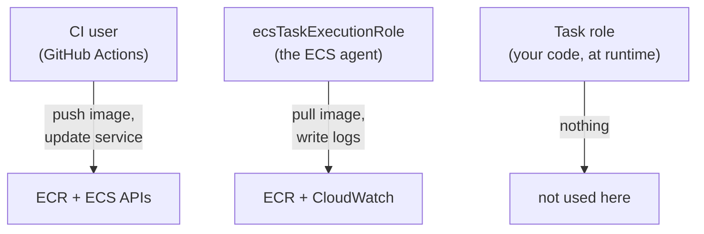

# devsecopcicdecr

A practice DevOps project: the same static "CloudStudy Ltd" marketing site, but instead of being
copied to an S3 bucket it is **baked into a Docker image, pushed to Amazon ECR, and served by a
container running on ECS Fargate**. Every push to `main` rebuilds and redeploys it through GitHub
Actions.

This is the follow-on to [devsecopcicds3](https://github.com/gideonclottey/devsecopcicds3), which
deploys the identical HTML as static files to S3. Running the same site through two very different
delivery models is the whole point: it isolates what actually changes when you move from object
storage to containers.

| | S3 version | This version |
|---|---|---|
| Live site | http://devsecopcicds3.s3-website.ca-central-1.amazonaws.com/index.html | http://3.99.185.21/ (ephemeral, see below) |
| Artifact | Raw HTML files | Docker image |
| Compute | None | ECS Fargate task |
| Deploy step | `aws s3 sync` | `docker push` + `ecs update-service` |
| Cost at rest | Pennies | Per-second, always on |
| Time to deploy | Seconds | A minute or two |

> **The URL above will stop working.** There is no load balancer, so the site is reached by the
> Fargate task's public IP, and a new IP is assigned every time the task is replaced: on each deploy,
> on a crash, on any change to the service. The address recorded here was current when this was
> written. To find the live one:
>
> ```bash
> TASK=$(aws ecs list-tasks --cluster devsecopcicdecr-cluster --query 'taskArns[0]' --output text)
> ENI=$(aws ecs describe-tasks --cluster devsecopcicdecr-cluster --tasks $TASK \
>   --query "tasks[0].attachments[0].details[?name=='networkInterfaceId'].value" --output text)
> aws ec2 describe-network-interfaces --network-interface-ids $ENI \
>   --query 'NetworkInterfaces[0].Association.PublicIp' --output text
> ```
>
> Compare this with the S3 version, whose URL is a permanent property of the bucket. Getting a stable
> address back is the main thing an ALB would buy here.

## The deployed site


The same HTML as the S3 version, reaching the browser by a completely different route: baked into a
container image, pulled from ECR, and served by nginx on Fargate.

## Pipeline



### Runtime architecture



## What's in the repo

| File | Purpose |
|---|---|
| `Dockerfile` | Three lines: `nginx:alpine`, copy the site in, expose 80 |
| `index.html` | Home page |
| `about.html` | Second page |
| `error.html` | Custom 404 page (unused in this version, see Known issues) |
| `style.css` | All styling, hand-written, no framework |
| `logo.png` | Favicon and nav logo |
| `task-definition.json` | The registered ECS task definition, pulled from AWS |
| `.github/workflows/ecr.yml` | The pipeline |

### The Dockerfile

```dockerfile
FROM   nginx:alpine
COPY . /usr/share/nginx/html
EXPOSE 80
```

`nginx:alpine` already ships a default config that serves `/usr/share/nginx/html` on port 80 with
`index.html` as the directory index, so nothing else is needed. `EXPOSE 80` is documentation for
humans and tooling; it does not publish anything by itself. The port mapping in the task definition
is what actually matters.

## AWS resources

| Resource | Name | Notes |
|---|---|---|
| Region | `ca-central-1` | |
| ECR repository | `devsecopcicdecr` | Private |
| ECS cluster | `devsecopcicdecr-cluster` | |
| ECS service | `devsecopcicdecs-td-service` | 1 task, no load balancer |
| Task definition family | `devsecopcicdecs-td` | Fargate, `awsvpc`, Linux/X86_64 |
| Networking | Default VPC, public subnet in `ca-central-1a` | `assignPublicIp: ENABLED` |
| Security group | `devsecopcicdecr-web-sg` | Inbound TCP 80 from `0.0.0.0/0` |
| Task size | 1 vCPU / 3 GB | Oversized, see Known issues |
| Log group | `/ecs/devsecopcicdecs-td` | `awslogs` driver, stream prefix `ecs` |
| Task execution role | `ecsTaskExecutionRole` | `AmazonECSTaskExecutionRolePolicy` |
| Task role | none | Deliberate, the container makes no AWS calls |

## The three identities

The single most useful thing this project taught me is that "permissions" here is not one thing. It
is three separate identities that are easy to confuse because they all touch ECR.



**1. The CI user** owns `AWS_ACCESS_KEY_ID` in repo secrets. It acts from outside AWS entirely.

```json
{
	"Version": "2012-10-17",
	"Statement": [
		{
			"Sid": "EcrLogin",
			"Effect": "Allow",
			"Action": ["ecr:GetAuthorizationToken"],
			"Resource": "*"
		},
		{
			"Sid": "EcrPushPull",
			"Effect": "Allow",
			"Action": [
				"ecr:BatchCheckLayerAvailability",
				"ecr:InitiateLayerUpload",
				"ecr:UploadLayerPart",
				"ecr:CompleteLayerUpload",
				"ecr:PutImage",
				"ecr:BatchGetImage",
				"ecr:GetDownloadUrlForLayer"
			],
			"Resource": "arn:aws:ecr:ca-central-1:<ACCOUNT_ID>:repository/devsecopcicdecr"
		},
		{
			"Sid": "EcsRedeploy",
			"Effect": "Allow",
			"Action": ["ecs:UpdateService", "ecs:DescribeServices"],
			"Resource": "arn:aws:ecs:ca-central-1:<ACCOUNT_ID>:service/devsecopcicdecr-cluster/<SERVICE_NAME>"
		}
	]
}
```

`ecr:GetAuthorizationToken` must be `"Resource": "*"`. It is an account-level call, not a
per-repository one, and scoping it to a repo ARN silently breaks the ECR login step.

**2. The task execution role** is assumed by the ECS agent, before and around the container. It
pulls the image and opens the log stream. It uses the managed policy
`AmazonECSTaskExecutionRolePolicy`, which grants six actions: four ECR read actions plus
`logs:CreateLogStream` and `logs:PutLogEvents`.

**3. The task role** is for AWS API calls made by code *inside* the container. Nginx serving static
files makes none, so this is intentionally left empty. An empty task role is a correct
configuration, not an unfinished one.

Both ECS roles are distinguished by their trust policy, which is what makes them appear in the ECS
console dropdowns at all:

```json
{
	"Effect": "Allow",
	"Principal": { "Service": "ecs-tasks.amazonaws.com" },
	"Action": "sts:AssumeRole"
}
```

## Configuration

Five secrets in **Settings → Secrets and variables → Actions**:

| Secret | Example shape |
|---|---|
| `AWS_ACCESS_KEY_ID` | CI user access key |
| `AWS_SECRET_ACCESS_KEY` | CI user secret |
| `AWS_REGION` | `ca-central-1` |
| `ECR_REPOSITORY_URI` | `<ACCOUNT_ID>.dkr.ecr.ca-central-1.amazonaws.com/devsecopcicdecr` |
| `ECS_CLUSTER_NAME` | `devsecopcicdecr-cluster` |
| `ECS_SERVICE_NAME` | the service name |

## What I learnt

**`aws ecs update-service` has no `--image` parameter.** My first working version passed one and the
CLI exited 252 with `Unknown options: --image`. The reason it does not exist is structural: a service
does not hold an image. A task definition holds the image, and a service points at a task definition.
There is no image-shaped hole in `update-service` to fill. What redeploys is `--force-new-deployment`,
which tells ECS to stop the running tasks and start replacements that pull the image again.

**A digest is not a tag.** Selecting an image through "Browse ECR images" in the console records an
immutable `@sha256:...` digest rather than a mutable `:latest` tag. That is better practice in
production and completely wrong for this pipeline, because re-pulling an immutable digest gives you
byte-for-byte the same image every time. See Known issues.

**A green deploy tells you nothing about reachability.** The pipeline went green, ECS reported the
task `RUNNING` and the container `RUNNING`, and the site timed out in the browser. The cause was the
default security group, whose only inbound rule allows traffic from resources sharing that same
group. Its IP range list was empty, so every packet from the internet was dropped before reaching
nginx. Nothing appeared in the ECS events or the CloudWatch logs, because the failure happened in
front of the container, and a component that is never reached has nothing to report.

On Fargate with `awsvpc`, a task needs **three** separate things to be publicly reachable, and
missing any one of them produces the same silent timeout:

1. A **public subnet**, one whose route table has a route to an internet gateway.
2. **`assignPublicIp: ENABLED`** on the service network configuration.
3. A **security group** permitting inbound traffic on the port.

Only the third was missing. The debugging lesson is to work outward from the container rather than
inward from the browser: confirm the task is running, then the container, then the IP assignment,
then the security group. Each check rules out a whole layer. Guessing at the URL first, which is
what I did, wasted the most time, since the IP had already changed underneath me when the service
picked up the corrected security group.

**Fixing the security group changes the IP.** Updating the service's network configuration replaces
the running task, and the public IP goes with it. I spent a while testing an address that belonged
to a task that no longer existed.

**`logs:CreateLogGroup` is not in the managed execution-role policy.** The task definition sets
`awslogs-create-group: true`, but `AmazonECSTaskExecutionRolePolicy` can write to a log group and not
create one. The mismatch shows up as a `ResourceInitializationError` at task start, which reads like
a networking problem and is not. Either add an inline policy for `logs:CreateLogGroup` or create the
log group yourself and set the flag to `false`.

**`describe-task-definition` does not round-trip.** The response includes read-only fields
(`taskDefinitionArn`, `revision`, `status`, `requiresAttributes`, `compatibilities`, `registeredAt`,
`registeredBy`) that `register-task-definition` rejects. [task-definition.json](task-definition.json)
was pulled with a `--query` filter that keeps only the writable fields.

**Containers moved the failure modes, not the amount of configuration.** The S3 version failed on
bucket policy and public access settings. This version fails on IAM role trust policies, log group
creation and image tag semantics. Neither is simpler. The container version buys a real runtime,
which this static site does not need, at the cost of always-on compute and a much longer list of
things that must line up.

**Nginx and read-only root filesystems.** Turning on "Read only root file system" breaks
`nginx:alpine`, which writes to `/var/cache/nginx` and `/var/run` at startup. It needs tmpfs mounts
to work, so it is off here.

## Known issues

These are real defects in the current state, documented rather than hidden.

- **The image is pinned by digest, so deploys do nothing.**
  [task-definition.json:8](task-definition.json#L8) references
  `devsecopcicdecr@sha256:a522d7dd...`. The pipeline pushes a new `:latest` on every commit, but the
  task definition never looks at `:latest`, so `--force-new-deployment` restarts tasks with the
  identical image. **The pipeline reports success and the site never changes.** This is the top
  priority fix: either repoint the task definition at `:latest`, or, better, register a new revision
  per deploy with a commit-SHA tag.

- **`:latest` is the wrong tag strategy anyway.** With a single mutable tag there is no rollback
  target, and no way to tell from the console which commit produced what is running.

- **Task is oversized.** 1 vCPU / 3 GB for static nginx. The Fargate minimum of 0.25 vCPU / 0.5 GB is
  ample and roughly a tenth of the cost.

- **No load balancer.** Without an ALB the task is reached by a public IP that changes on every
  replacement, so there is no stable URL, no HTTPS, and no health-check-driven rollout. Any URL
  written down here is correct only until the next deploy.

- **The task is directly exposed to the internet.** Port 80 is open to `0.0.0.0/0` on the task's own
  security group, so the container is addressable from anywhere. The better shape is to allow 80 and
  443 only on an ALB, and restrict the task's security group to traffic from the load balancer's
  security group, leaving the container unreachable directly.

- **The custom 404 is not wired up.** `error.html` is copied into the image but default nginx serves
  its own built-in 404 page. It needs an `error_page 404 /error.html;` directive in a custom config.

- **Long-lived IAM access keys.** GitHub's OIDC provider assuming an IAM role would remove static
  keys from the repo entirely. Same gap as the S3 project.

- **`task-definition.json` contains the AWS account ID.** It appears in `executionRoleArn` and the
  image URI. Not a credential, but if this repo is public it is free reconnaissance. Consider
  gitignoring the file or substituting a placeholder at deploy time.

- **The Dockerfile copies everything.** `COPY . /usr/share/nginx/html` includes `.git/`,
  `README.md`, `task-definition.json` and the workflow directory in the published image. A
  `.dockerignore` would fix this. The S3 version was careful about exactly this and the container
  version silently regressed it.

## Troubleshooting

**Deploy succeeded but the site does not load.** Work outward from the container. Each command rules
out a layer, and the first one that returns something unexpected is the fault.

```bash
CLUSTER=devsecopcicdecr-cluster

# 1. Is a task running at all?
aws ecs list-tasks --cluster $CLUSTER --desired-status RUNNING

# 2. Is the container up, or did it fail to start?
TASK=$(aws ecs list-tasks --cluster $CLUSTER --query 'taskArns[0]' --output text)
aws ecs describe-tasks --cluster $CLUSTER --tasks $TASK \
  --query 'tasks[0].{task:lastStatus,containers:containers[].{status:lastStatus,reason:reason}}'

# 3. Did it get a public IP, and which security group is actually attached?
ENI=$(aws ecs describe-tasks --cluster $CLUSTER --tasks $TASK \
  --query "tasks[0].attachments[0].details[?name=='networkInterfaceId'].value" --output text)
aws ec2 describe-network-interfaces --network-interface-ids $ENI \
  --query 'NetworkInterfaces[0].{PublicIp:Association.PublicIp,SG:Groups}'

# 4. Does that security group actually allow port 80 inbound?
aws ec2 describe-security-groups --group-ids <sg-id-from-step-3> \
  --query 'SecurityGroups[0].IpPermissions'
```

Read step 3 against the service's configured security group, not the one you assume is attached.
A running task keeps the group it was launched with, so after changing the service the old task is
still on the old group until it is replaced.

```bash
aws ecs describe-services --cluster $CLUSTER --services devsecopcicdecs-td-service \
  --query 'services[0].networkConfiguration.awsvpcConfiguration'
```

**Task stops immediately with `ResourceInitializationError`.** Usually the execution role, not the
network. Either it cannot pull from ECR, or it lacks `logs:CreateLogGroup` while the task definition
sets `awslogs-create-group: true`.

**Deploy is green but the content is unchanged.** The digest pin described under Known issues.

## Next steps

1. Fix the digest pin so deploys actually deploy.
2. Add a `.dockerignore`.
3. Tag images with `${{ github.sha }}` and switch to
   `aws-actions/amazon-ecs-render-task-definition` plus `amazon-ecs-deploy-task-definition`, which
   registers a revision per commit and waits for the service to stabilise instead of firing and
   forgetting.
4. Put an Application Load Balancer in front of the service for a stable URL and HTTPS.
5. Move CI from access keys to OIDC role assumption.
6. Add an image scan step, which is the "sec" in DevSecOps that neither project has yet.

## Running it yourself

1. Create a private ECR repository in `ca-central-1`.
2. Create an ECS cluster on Fargate.
3. Register a task definition: 0.25 vCPU / 0.5 GB, `awsvpc`, container port 80, image
   `<repo-uri>:latest`, execution role `ecsTaskExecutionRole`, no task role, `awslogs` logging.
4. Create a service from that task definition with a public IP or an ALB.
5. Create an IAM user with the CI policy above and add the five secrets to the repo.
6. Push to `main`.
